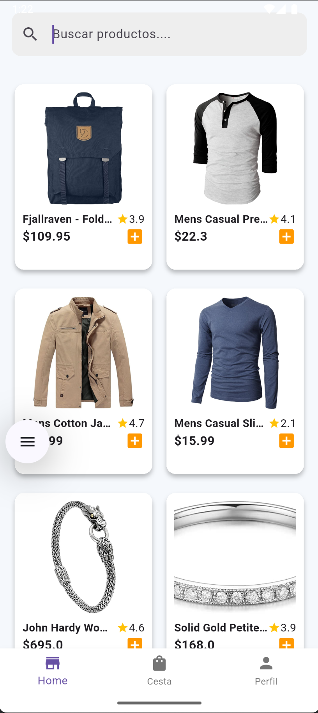
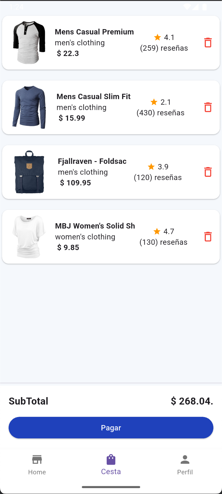
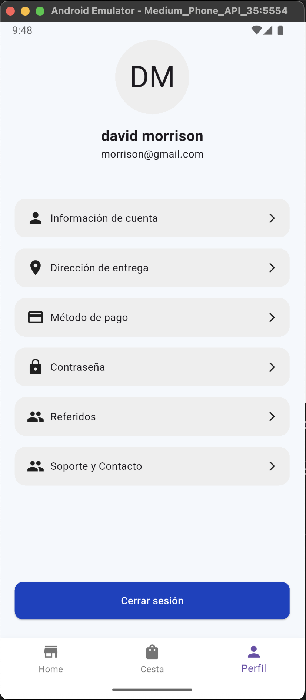
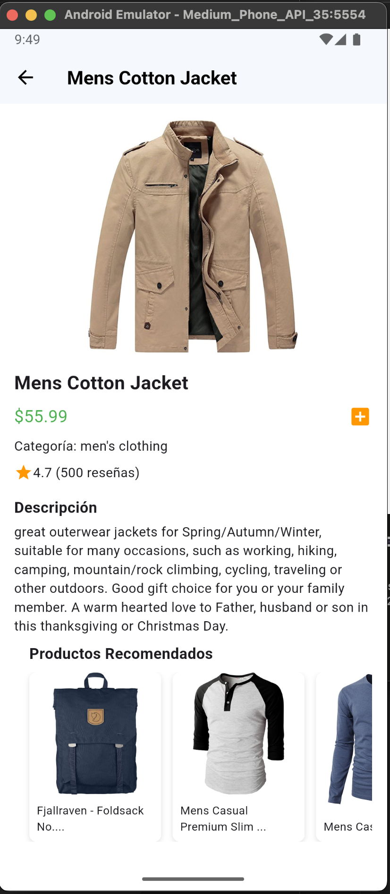
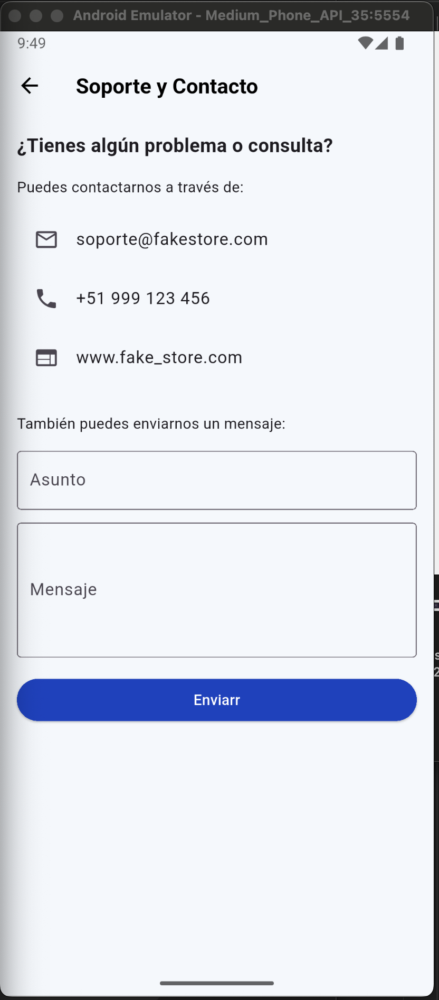

# 🛍️ Fake Store App

Una aplicación de ejemplo hecha en Flutter que simula una tienda virtual. Permite explorar productos, agregarlos al carrito, ver detalles del usuario y realizar búsquedas. La app está construida con una arquitectura modular y usa BLoC para la gestión del estado.

---

## 📲 Funcionalidades

- 🔐 Autenticación
- 🛒 Agregar productos al carrito
- 🧮 Cálculo de subtotal
- 🔍 Búsqueda de productos
- 🌈 Interfaz responsiva y modular
- 🧱 Arquitectura escalable (features)

---

## 📁 Estructura del proyecto

```bash
lib
├── core
│   ├── routing
│   │   └── app_router.dart
│   └── theme
│       ├── colors.dart
│       └── light_theme.dart
├── features
│   ├── auth
│   │   ├── data
│   │   │   └── auth_service.dart
│   │   ├── models
│   │   │   ├── login_request.dart
│   │   │   └── login_response.dart
│   │   ├── screen
│   │   │   └── login_screen.dart
│   │   └── state
│   │       ├── auth_bloc.dart
│   │       ├── auth_event.dart
│   │       └── auth_state.dart
│   ├── home
│   │   ├── data
│   │   ├── models
│   │   │   ├── car_store.dart
│   │   │   └── cart_item.dart
│   │   ├── screens
│   │   │   ├── home_shell.dart
│   │   │   ├── porduct_detailts.dart
│   │   │   ├── process_payment.dart
│   │   │   └── tabs
│   │   │       ├── cart_tab.dart
│   │   │       ├── home_tab.dart
│   │   │       └── profile_tab.dart
│   │   ├── state
│   │   │   ├── cart
│   │   │   │   ├── cart_bloc.dart
│   │   │   │   ├── cart_event.dart
│   │   │   │   └── cart_state.dart
│   │   │   ├── products
│   │   │   │   ├── product_bloc.dart
│   │   │   │   ├── product_event.dart
│   │   │   │   └── product_state.dart
│   │   │   └── user
│   │   │       ├── user_bloc.dart
│   │   │       ├── user_event.dart
│   │   │       └── user_state.dart
│   │   └── widgets
│   │       ├── cart_item.dart
│   │       ├── product_card.dart
│   │       ├── profile_option_tile.dart
│   │       ├── quantity_cart.dart
│   │       └── recommended_products.dart
│   └── support_contact
│       ├── models
│       └── screen
│           └── support_contact.dart
├── main.dart
└── shared
    ├── utils
    └── widgets
```

## Arquitectura

La aplicación está basada en una arquitectura modular y limpia, con separación de responsabilidades clara:

- features/ organiza el código por módulos funcionales.
- Uso de flutter_bloc para el manejo del estado.
- data/ para servicios.
- state/ para los blocs.
- widgets/ reutilizables.
- Navegación con go_router.

## Dependencias

```bash
dependencies:
  flutter:
    sdk: flutter
  cupertino_icons: ^1.0.8
  go_router: ^15.2.4
  flutter_bloc: ^9.1.1
  dartz: ^0.10.1
  http: ^1.4.0
  sign_in_button: ^4.0.1
  jwt_decoder: ^2.0.1

```

## ✅ Funcionalidades Implementadas

- [x] Página Principal con productos destacados y promociones.
- [x] Catálogo de Productos con filtrado por categorías.
- [x] Página de Búsqueda de productos.
- [x] Detalle del Producto con recomendados.
- [x] Autenticación (Inicio de sesión).
- [x] Página del Carrito (agregar, quitar, actualizar cantidades).
- [x] Página de Soporte y Contacto.
- [x] Responsive para distintos dispositivos.
- [x] Consumo de API Fake Store desde paquete Dart personalizado.
- [x] Sistema de diseño personalizado.
- [x] Consumo de API desde paquete Dart (`fake_store_client`)

## Diagrama


## 🚀 Mejoras pendientes

- [ ] Animación de "fly-to-cart"
- [ ] Wishlist (favoritos)
- [ ] Persistencia local con `shared_preferences` o `hive`
- [ ] Registro real de usuarios

---

## ▶️ Ejecución

1. Clona el repositorio.
2. Ejecuta `flutter pub get`.
3. Corre el proyecto con `flutter run`.

---

## ✍️ Autor

Proyecto desarrollado por **Jamz**  
💻 `jamz@jose-montenegro`

---

## 📸 Capturas

### 🏠 Pantalla de inicio

## 📸 Captura redimensionada



### 🛒 Pantalla del carrito


### 👤 Pantalla del perfil


### 🛍️ Detalle de producto




### 👤 Soporte 




## Git


