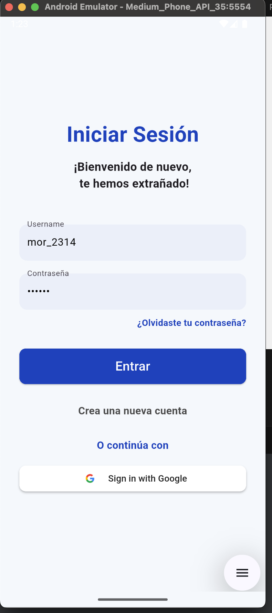

# 🛍️ Fake Store App

Una aplicación de ejemplo hecha en Flutter que simula una tienda virtual. Permite explorar productos, agregarlos al carrito, ver detalles del usuario y realizar búsquedas. La app está construida con una arquitectura modular y usa BLoC para la gestión del estado.

---

## 📲 Funcionalidades

- 🔐 Autenticación
- 🛒 Agregar productos al carrito
- 🧮 Cálculo de subtotal
- 🔍 Búsqueda de productos
- 🌈 Interfaz responsiva y modular
- 🧱 Arquitectura escalable (features)

---

## 📁 Estructura del proyecto

```bash
lib/
├── core/                     # Configuración base del proyecto
│   ├── routing/              # Enrutamiento con go_router
│   │   └── app_router.dart
│   └── theme/                # Estilos globales
│       ├── colors.dart
│       └── light_theme.dart
├── features/                 # Módulos funcionales
│   ├── auth/                 # Autenticación
│   │   ├── data/
│   │   │   └── auth_service.dart
│   │   ├── models/
│   │   │   ├── login_request.dart
│   │   │   └── login_response.dart
│   │   ├── screen/
│   │   │   └── login_screen.dart
│   │   └── state/
│   │       ├── auth_bloc.dart
│   │       ├── auth_event.dart
│   │       └── auth_state.dart
│   └── home/                 # Módulo principal (Home)
│       ├── data/
│       │   ├── product_service.dart
│       │   └── user_service.dart
│       ├── models/
│       │   ├── car_store.dart
│       │   ├── cart_item.dart
│       │   ├── product.dart
│       │   └── user.dart
│       ├── screens/
│       │   ├── home_screen.dart
│       │   ├── home_shell.dart
│       │   └── tabs/
│       │       ├── cart_tab.dart
│       │       ├── home_tab.dart
│       │       └── profile_tab.dart
│       ├── state/
│       │   ├── cart_bloc.dart
│       │   ├── cart_event.dart
│       │   ├── cart_state.dart
│       │   ├── product_bloc.dart
│       │   ├── product_event.dart
│       │   ├── product_state.dart
│       │   ├── user_bloc.dart
│       │   ├── user_event.dart
│       │   └── user_state.dart
│       └── widgets/
│           ├── cart_item.dart
│           ├── product_card.dart
│           └── profile_option_tile.dart
├── main.dart                 # Punto de entrada
└── shared/
    ├── utils/
    └── widgets/
```

## Arquitectura

La aplicación está basada en una arquitectura modular y limpia, con separación de responsabilidades clara:

- features/ organiza el código por módulos funcionales.
- Uso de flutter_bloc para el manejo del estado.
- data/ para servicios.
- state/ para los blocs.
- widgets/ reutilizables.
- Navegación con go_router.

## Dependencias

```bash
dependencies:
  flutter:
    sdk: flutter
  cupertino_icons: ^1.0.8
  go_router: ^15.2.4
  flutter_bloc: ^9.1.1
  dartz: ^0.10.1
  http: ^1.4.0
  sign_in_button: ^4.0.1
  jwt_decoder: ^2.0.1

```

## 🧪 Estado actual

- ✅ Autenticación
- ✅ Búsqueda de productos
- ✅ Bloc funcional para carrito
- ✅ Subtotal funcional
- ✅ Diseño responsive
- ✅ Separación en módulos y bloc

---

## 🚀 Mejoras pendientes

- [ ] Animación de "fly-to-cart"
- [ ] Página de detalles del producto
- [ ] Wishlist (favoritos)
- [ ] Persistencia local con `shared_preferences` o `hive`
- [ ] Registro real de usuarios

---

## ▶️ Ejecución

1. Clona el repositorio.
2. Ejecuta `flutter pub get`.
3. Corre el proyecto con `flutter run`.

---

## ✍️ Autor

Proyecto desarrollado por **Jamz**  
💻 `jamz@jose-montenegro`

---

## 📸 Capturas

### 🏠 Pantalla de inicio

## 📸 Captura redimensionada


### 🛒 Pantalla del carrito


### 👤 Pantalla del perfil

